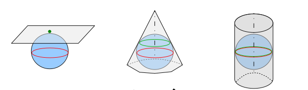
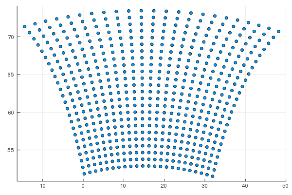

# Domains.jl documentation

## Installation 

You can obtain Domains.jl using Julia's Pkg REPL-mode (hitting `]` as the first character of the command prompt):

```julia
(v1.3) pkg> add https://github.com/Hirlam/Domains.jl
```

## Domain projections 

There are four projections available in HARMONIE
 * polar stereographic, 
 * lambert, 
 * mercator 
 * rotated mercator. 
 The model itself chooses the best (least distortion) projection among the first three given your domain specifications. The rotated mercator projection is selected through the variable LROTMER.


!!! note "GRIB1 vs GRIB2" 

    The polar stereographic project is defined at 90°N(S) whereas in GRIB1 it is defined at 60°N(S). 



Polar stereographic, Lambert and Mercator projection


Rotated mercator projection


## Model domain settings

For each domain we set variables related to the geometry and the resolution like:

The following variables related to the geometry and the resolution are required:

| Variable | Description | 
| :------- | :---------- |
| `TSTEP`  | model timestep in seconds |
| `NLON`   | number of points in x-direction |
| `NLAT`   | number of points in y-direction |
| `LONC`   | longitude of domain centre in degrees |
| `LATC`   | latitude of domain center in degrees |
| `LON0`   | reference longitude of the projection in degrees |
| `LAT0`   | reference latitude of the projection in degrees| 
| `GSIZE`  | grid size in meters in both x- and y-direction |
| `EZONE`  | number of points over extension zone in both x- and y-direction |
| `LMRT`   | switch for rotated Mercator projection. If LMRT=.TRUE. LAT0 should be zero | 

!!! note 
      * If `LAT0 = 90`, the projection is polar stereographic. 
      * If `LAT0 < 90`, the projection is lambert unless `LMRT=.TRUE.`._

!!! note "Restriction on NLON and NLAT"

    `NLON` and `NLAT` should satisfy the equation ``5^a ⋅ 3^b ⋅ 2^c``, where either ``a ≥ 1, b ≥ 0, c ≥ 0``  or ``a=b=c=0`` 

## Example

```julia 
using Domains, Plots
d = readdomain("METCOOP25C")
gp = getgridpoints(d,gsize=100000)
scatter(getindex.(gp,1),getindex.(gp,2),legend=false)
```

Will give 




    `NLON` and `NLAT` should satisfy the equation ``2^a ⋅ 3^b ⋅ 5^c``, where `` a ≥ 1 `` and ``b,c ≥ 0 ``. 


```@autodocs
   Modules = [Domains]
```

